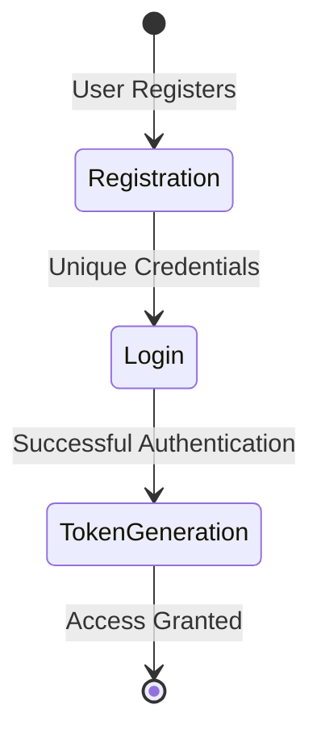

# 🔐 Register-Login-System

A secure FastAPI-based user registration and authentication system with SQLAlchemy ORM integration.

## 🌟 Project Overview

This project provides a robust backend solution for user registration and login functionality using FastAPI, SQLAlchemy, and SQLite. It offers secure token-based authentication and seamless database integration.

## 🏗️ System Architecture



## 🚀 Features

- 🔑 Secure user registration
- 🔒 Token-based authentication
- 💾 SQLite database integration
- 🛡️ Duplicate user prevention
- 🔄 Dynamic token generation

## 📦 Prerequisites

- Python 3.8+
- FastAPI
- SQLAlchemy
- uvicorn

## 🛠️ Installation

1. Clone the repository:
   ```bash
   git clone https://github.com/Caio-Felice-Cunha/Register-Login-System.git
   cd Register-Login-System
   ```

2. Create a virtual environment:
   ```bash
   python -m venv venv
   source venv/bin/activate  # On Windows, use `venv\Scripts\activate`
   ```

3. Install dependencies:
   ```bash
   pip install fastapi sqlalchemy uvicorn
   ```

4. Run the application:
   ```bash
   uvicorn main:app --reload
   ```

## 🔍 Endpoints

- `POST /register`: Register a new user
  - Parameters: `name`, `user`, `passwd`
- `POST /login`: User login
  - Parameters: `user`, `passwd`
  - Returns: Authentication token

## 👥 Contributing

1. Fork the repository
2. Create a feature branch:
   ```bash
   git checkout -b feature/your-feature-name
   ```
3. Commit your changes:
   ```bash
   git commit -m 'Add some feature'
   ```
4. Push to the branch:
   ```bash
   git push origin feature/your-feature-name
   ```
5. Open a Pull Request

### Development Setup

- Ensure you have Python 3.8+ installed
- Install development dependencies:
  ```bash
  pip install -r requirements-dev.txt
  ```

## 🚧 Known Issues

- Current implementation stores passwords in plain text
- Limited error handling
- No password complexity requirements

## 🔮 Future Roadmap

- Implement password hashing
- Add password complexity validation
- Enhance token management
- Implement password reset functionality

## 📄 License

This project is licensed under the MIT License. See the LICENSE file for details.

## ⚖️ Credits

This project was developed as part of the "4 Days 4 Projects" initiative by [Pythonando](https://pythonando.com.br) on YouTube.