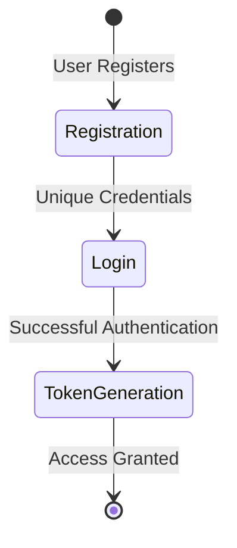

# 🔐 Register-Login-System

A small FastAPI-based user registration and login service backed by SQLAlchemy ORM and SQLite.

## 🌟 Project Overview

This project is a compact backend for user registration and login built with FastAPI, SQLAlchemy, and SQLite. Registration stores a salted PBKDF2 password hash, login verifies the password and issues a random session token, and each username is unique. It is a learning project, not a production auth service. See [Known Issues](#-known-issues) for what is intentionally out of scope.

Register a user, log in with the correct password, and you get a token back. That is the whole flow.

## 🏗️ System Architecture


```mermaid
stateDiagram-v2
    [*] --> Registration: User Registers
    Registration --> Login: Unique Credentials
    Login --> TokenGeneration: Successful Authentication
    TokenGeneration --> [*]: Access Granted
```

## 🚀 Features

- 🔑 User registration with salted PBKDF2 password hashing (stdlib, no extra dependencies)
- 🔒 Token-based login (random 100-character hex token, rotated on each login)
- 💾 SQLite database integration (connection string configurable via `DATABASE_URL`)
- 🛡️ Duplicate user prevention (unique username, enforced in code and by a DB constraint)
- 🔄 Token generation that retries until the value is unique

## 📦 Prerequisites

- Python 3.8+
- FastAPI
- SQLAlchemy
- uvicorn

## 🛠️ Installation

1. Clone the repository:
   ```bash
   git clone https://github.com/Caio-Felice-Cunha/Register-Login-System.git
   cd Register-Login-System
   ```

2. Create a virtual environment:
   ```bash
   python -m venv venv
   source venv/bin/activate  # On Windows, use `venv\Scripts\activate`
   ```

3. Install dependencies:
   ```bash
   pip install -r requirements.txt
   ```

4. Run the application:
   ```bash
   uvicorn main:app --reload
   ```

The SQLite database (`userDB.db`) is created automatically on first import, so there is no separate migration step. To point at a different database, set `DATABASE_URL` (see `.env.example`).

## 🔍 Endpoints

Credentials are sent in the JSON request body, not as query parameters, so they do not end up in URLs or server access logs.

- `POST /register`: Register a new user
  - Body (JSON): `{"name": "...", "user": "...", "passwd": "..."}`
  - Returns: `{"status": "success"}` or `{"status": "User already registered"}`
- `POST /login`: Log in
  - Body (JSON): `{"user": "...", "passwd": "..."}`
  - Returns: `{"token": "..."}` on success, or `{"status": "user not registered"}` on a bad username or password

Example:

```bash
curl -X POST http://127.0.0.1:8000/register \
  -H "Content-Type: application/json" \
  -d '{"name": "Alice", "user": "alice", "passwd": "s3cret"}'

curl -X POST http://127.0.0.1:8000/login \
  -H "Content-Type: application/json" \
  -d '{"user": "alice", "passwd": "s3cret"}'
```

## 👥 Contributing

1. Fork the repository
2. Create a feature branch:
   ```bash
   git checkout -b feature/your-feature-name
   ```
3. Commit your changes:
   ```bash
   git commit -m 'Add some feature'
   ```
4. Push to the branch:
   ```bash
   git push origin feature/your-feature-name
   ```
5. Open a Pull Request

### Development Setup

- Ensure you have Python 3.8+ installed
- Install development dependencies (includes the test tools):
  ```bash
  pip install -r requirements-dev.txt
  ```

## 🧪 Running tests

The test suite uses FastAPI's `TestClient` and a throwaway SQLite database (it never touches `userDB.db`).

```bash
pip install -r requirements-dev.txt
pytest -q
```

The tests cover registration, duplicate-username rejection, login success and failure, token rotation, and that passwords are stored hashed rather than in plaintext.

## 🔎 Findings (audit pass)

A review of the original tutorial code found and fixed the following, each verified by the test suite above:

- **Duplicate-username bug.** The registration existence check filtered by both username and password, so the same username could be registered again with a different password. Two rows for one username could coexist. Fixed by checking the username only and adding a unique constraint on `Person.user`. This makes the "Duplicate user prevention" feature actually hold.
- **Plaintext passwords.** Passwords were stored as-is in a `String(10)` column. Now stored as salted PBKDF2-HMAC-SHA256 hashes (240,000 iterations, 16-byte random salt) in a widened column, using only the standard library.
- **Credentials in the URL.** Endpoints took bare `str` parameters, which FastAPI maps to query parameters on POST, leaking credentials into URLs and access logs. Both endpoints now take a Pydantic JSON body.
- **SQL logging of secrets.** `create_engine(..., echo=True)` printed every statement, including the `INSERT` carrying the password, to stdout. `echo` is now off.
- **Engine/session handling.** A new engine was built on every request and sessions were never closed. There is now one shared engine and sessionmaker, and sessions are closed via a FastAPI dependency.
- **Inconsistent login response.** `/login` returned a bare JSON string while `/register` returned an object. `/login` now returns `{"token": "..."}`.
- **Stale token date.** Rotating a token updated the token value but not its `date`. The date is now refreshed on rotation.
- **Dead code.** Removed an empty `controller.py`, unused imports (`from tokenize import Token`, `declarative_base` in `main.py`), and the unused/malformed commented-out MySQL connection constants.

## 🚧 Known Issues

- Tokens do not expire and there is no logout endpoint.
- No password complexity requirements.
- No rate limiting or account lockout.
- This is a learning project; do not use it as-is for production authentication.

## 🔮 Future Roadmap

- Add token expiry and a logout/refresh flow.
- Add password complexity validation.
- Add a password reset flow.
- Add rate limiting on login.

## 📄 License

This project is licensed under the MIT License. See the LICENSE file for details.

## ⚖️ Credits

This project was developed as part of the "4 Days 4 Projects" initiative by [Pythonando](https://pythonando.com.br) on YouTube.